# Phase 9 experiment analysis

Runs discovered: 15. Complete test caches: 300. Offline audit flags: 0. Analysis warnings: 0.

## Run overview

| run_id | seed | complete | observed_steps | average_incremental_accuracy | final_accuracy | final_old_accuracy | final_new_accuracy |
| --- | --- | --- | --- | --- | --- | --- | --- |
| phase9_periodic_fixed_h200_seed42 | 42 | True | 10 | 0.56012 | 0.3928 | 0.40822 | 0.254 |
| phase9_periodic_fixed_h200_seed43 | 43 | True | 10 | 0.56613 | 0.406 | 0.42067 | 0.274 |
| phase9_periodic_fixed_h200_seed44 | 44 | True | 10 | 0.55983 | 0.4034 | 0.41933 | 0.26 |
| phase9_periodic_sample_aware_h200_seed42 | 42 | True | 10 | 0.56296 | 0.3976 | 0.41422 | 0.248 |
| phase9_periodic_sample_aware_h200_seed43 | 43 | True | 10 | 0.56582 | 0.4084 | 0.42222 | 0.284 |
| phase9_periodic_sample_aware_h200_seed44 | 44 | True | 10 | 0.56359 | 0.4088 | 0.42733 | 0.242 |
| phase9_prototype_bank_direct_h200_seed42 | 42 | True | 10 | 0.56175 | 0.3914 | 0.40711 | 0.25 |
| phase9_prototype_bank_direct_h200_seed43 | 43 | True | 10 | 0.56305 | 0.4028 | 0.42244 | 0.226 |
| phase9_prototype_bank_direct_h200_seed44 | 44 | True | 10 | 0.55946 | 0.4044 | 0.42489 | 0.22 |
| phase9_prototype_bank_smooth_h200_seed42 | 42 | True | 10 | 0.5614 | 0.3972 | 0.416 | 0.228 |
| phase9_prototype_bank_smooth_h200_seed43 | 43 | True | 10 | 0.56457 | 0.4116 | 0.42622 | 0.28 |
| phase9_prototype_bank_smooth_h200_seed44 | 44 | True | 10 | 0.56196 | 0.4032 | 0.42022 | 0.25 |
| phase9_uniform_cl_history_h200_seed42 | 42 | True | 10 | 0.56459 | 0.398 | 0.41089 | 0.282 |
| phase9_uniform_cl_history_h200_seed43 | 43 | True | 10 | 0.56771 | 0.4084 | 0.41689 | 0.332 |
| phase9_uniform_cl_history_h200_seed44 | 44 | True | 10 | 0.56375 | 0.408 | 0.42289 | 0.274 |

## Method and paired-seed summaries

| method | protocol_id | metric | n_seeds | mean | sd | paired_n_seeds | delta_mean_pp | improved_seeds |
| --- | --- | --- | --- | --- | --- | --- | --- | --- |
| periodic_fixed | 1e00921e7aa95831 | average_incremental_accuracy | 3 | 0.56203 | 0.0035555 | 3 | -0.33214 | 0 |
| periodic_fixed | 1e00921e7aa95831 | final_accuracy | 3 | 0.40073 | 0.0069924 | 3 | -0.40667 | 0 |
| periodic_fixed | 1e00921e7aa95831 | final_macro_f1 | 3 | 0.39534 | 0.00601 | 3 | -0.71522 | 0 |
| periodic_fixed | 1e00921e7aa95831 | final_forgetting | 3 | 0.18089 | 0.0063285 | 3 | -0.54815 | 3 |
| periodic_fixed | 1e00921e7aa95831 | average_forgetting | 3 | 0.094061 | 0.0050709 | 3 | -0.41757 | 3 |
| periodic_fixed | 1e00921e7aa95831 | final_old_accuracy | 3 | 0.41607 | 0.0068325 | 3 | -0.081481 | 1 |
| periodic_fixed | 1e00921e7aa95831 | final_new_accuracy | 3 | 0.26267 | 0.010263 | 3 | -3.3333 | 0 |
| periodic_sample_aware | 1e00921e7aa95831 | average_incremental_accuracy | 3 | 0.56413 | 0.0015032 | 3 | -0.12228 | 0 |
| periodic_sample_aware | 1e00921e7aa95831 | final_accuracy | 3 | 0.40493 | 0.006354 | 3 | 0.013334 | 1 |
| periodic_sample_aware | 1e00921e7aa95831 | final_macro_f1 | 3 | 0.39878 | 0.0066904 | 3 | -0.37174 | 0 |
| periodic_sample_aware | 1e00921e7aa95831 | final_forgetting | 3 | 0.17704 | 0.0036672 | 3 | -0.93333 | 3 |
| periodic_sample_aware | 1e00921e7aa95831 | average_forgetting | 3 | 0.093006 | 0.011157 | 3 | -0.52311 | 3 |
| periodic_sample_aware | 1e00921e7aa95831 | final_old_accuracy | 3 | 0.42126 | 0.0066084 | 3 | 0.43704 | 3 |
| periodic_sample_aware | 1e00921e7aa95831 | final_new_accuracy | 3 | 0.258 | 0.022716 | 3 | -3.8 | 0 |
| prototype_bank_direct | 1e00921e7aa95831 | average_incremental_accuracy | 3 | 0.56142 | 0.0018133 | 3 | -0.39268 | 0 |
| prototype_bank_direct | 1e00921e7aa95831 | final_accuracy | 3 | 0.39953 | 0.0070889 | 3 | -0.52667 | 0 |
| prototype_bank_direct | 1e00921e7aa95831 | final_macro_f1 | 3 | 0.3942 | 0.0059489 | 3 | -0.82977 | 0 |
| prototype_bank_direct | 1e00921e7aa95831 | final_forgetting | 3 | 0.17644 | 0.0088778 | 3 | -0.99259 | 3 |
| prototype_bank_direct | 1e00921e7aa95831 | average_forgetting | 3 | 0.096497 | 0.0057295 | 3 | -0.17404 | 2 |
| prototype_bank_direct | 1e00921e7aa95831 | final_old_accuracy | 3 | 0.41815 | 0.0096362 | 3 | 0.12593 | 2 |
| prototype_bank_direct | 1e00921e7aa95831 | final_new_accuracy | 3 | 0.232 | 0.015875 | 3 | -6.4 | 0 |
| prototype_bank_smooth | 1e00921e7aa95831 | average_incremental_accuracy | 3 | 0.56264 | 0.0016929 | 3 | -0.27037 | 0 |
| prototype_bank_smooth | 1e00921e7aa95831 | final_accuracy | 3 | 0.404 | 0.0072333 | 3 | -0.08 | 1 |
| prototype_bank_smooth | 1e00921e7aa95831 | final_macro_f1 | 3 | 0.39833 | 0.0080552 | 3 | -0.41691 | 0 |
| prototype_bank_smooth | 1e00921e7aa95831 | final_forgetting | 3 | 0.17185 | 0.0067195 | 3 | -1.4519 | 3 |
| prototype_bank_smooth | 1e00921e7aa95831 | average_forgetting | 3 | 0.091101 | 0.0055343 | 3 | -0.71364 | 3 |
| prototype_bank_smooth | 1e00921e7aa95831 | final_old_accuracy | 3 | 0.42081 | 0.0051368 | 3 | 0.39259 | 2 |
| prototype_bank_smooth | 1e00921e7aa95831 | final_new_accuracy | 3 | 0.25267 | 0.026102 | 3 | -4.3333 | 0 |
| uniform | 1e00921e7aa95831 | average_incremental_accuracy | 3 | 0.56535 | 0.0020858 | 0 |  | 0 |
| uniform | 1e00921e7aa95831 | final_accuracy | 3 | 0.4048 | 0.0058924 | 0 |  | 0 |
| uniform | 1e00921e7aa95831 | final_macro_f1 | 3 | 0.40249 | 0.0077191 | 0 |  | 0 |
| uniform | 1e00921e7aa95831 | final_forgetting | 3 | 0.18637 | 0.00378 | 0 |  | 0 |
| uniform | 1e00921e7aa95831 | average_forgetting | 3 | 0.098237 | 0.0075209 | 0 |  | 0 |
| uniform | 1e00921e7aa95831 | final_old_accuracy | 3 | 0.41689 | 0.006 | 0 |  | 0 |
| uniform | 1e00921e7aa95831 | final_new_accuracy | 3 | 0.296 | 0.031432 | 0 |  | 0 |

## Fixed-model fusion decomposition

For each matching seed, protocol, task and checkpoint kind: DD-U0 = (DD-D0) + (D0-U0). DD uses dynamic-model parameters and saved gates; D0 uses those parameters with equal fusion; U0 is the independently trained uniform baseline. The second term includes all parameter and training-trajectory differences; it is not a pure causal representation effect. Best and last stay separate.

| run_id | step | kind | metric | total_delta_pp | fixed_model_gate_effect_pp | trained_parameters_difference_pp |
| --- | --- | --- | --- | --- | --- | --- |
| phase9_periodic_fixed_h200_seed42 | 0 | best | accuracy | 0 | 0 | 0 |
| phase9_periodic_fixed_h200_seed42 | 0 | best | macro_f1 | 0 | 0 | 0 |
| phase9_periodic_fixed_h200_seed42 | 0 | best | old_accuracy |  |  |  |
| phase9_periodic_fixed_h200_seed42 | 0 | best | new_accuracy | 0 | 0 | 0 |
| phase9_periodic_fixed_h200_seed42 | 0 | last | accuracy | 0 | 0 | 0 |
| phase9_periodic_fixed_h200_seed42 | 0 | last | macro_f1 | 0 | 0 | 0 |
| phase9_periodic_fixed_h200_seed42 | 0 | last | old_accuracy |  |  |  |
| phase9_periodic_fixed_h200_seed42 | 0 | last | new_accuracy | 0 | 0 | 0 |
| phase9_periodic_fixed_h200_seed42 | 1 | best | accuracy | 0.3 | 1.6 | -1.3 |
| phase9_periodic_fixed_h200_seed42 | 1 | best | macro_f1 | -0.14281 | 1.5354 | -1.6782 |
| phase9_periodic_fixed_h200_seed42 | 1 | best | old_accuracy | 1.2 | 1 | 0.2 |
| phase9_periodic_fixed_h200_seed42 | 1 | best | new_accuracy | -0.6 | 2.2 | -2.8 |
| phase9_periodic_fixed_h200_seed42 | 1 | last | accuracy | -1.2 | 1.5 | -2.7 |
| phase9_periodic_fixed_h200_seed42 | 1 | last | macro_f1 | -1.2241 | 1.8458 | -3.0699 |
| phase9_periodic_fixed_h200_seed42 | 1 | last | old_accuracy | -0.4 | 0.2 | -0.6 |
| phase9_periodic_fixed_h200_seed42 | 1 | last | new_accuracy | -2 | 2.8 | -4.8 |
| phase9_periodic_fixed_h200_seed42 | 2 | best | accuracy | 0.33333 | 0.6 | -0.26667 |
| phase9_periodic_fixed_h200_seed42 | 2 | best | macro_f1 | 0.10754 | 0.28231 | -0.17476 |
| phase9_periodic_fixed_h200_seed42 | 2 | best | old_accuracy | 1.3 | 1.9 | -0.6 |
| phase9_periodic_fixed_h200_seed42 | 2 | best | new_accuracy | -1.6 | -2 | 0.4 |
| phase9_periodic_fixed_h200_seed42 | 2 | last | accuracy | 0.066667 | 0.4 | -0.33333 |
| phase9_periodic_fixed_h200_seed42 | 2 | last | macro_f1 | -0.24262 | -0.033925 | -0.20869 |
| phase9_periodic_fixed_h200_seed42 | 2 | last | old_accuracy | 1.1 | 1.7 | -0.6 |
| phase9_periodic_fixed_h200_seed42 | 2 | last | new_accuracy | -2 | -2.2 | 0.2 |
| phase9_periodic_fixed_h200_seed42 | 3 | best | accuracy | 0.55 | 1.1 | -0.55 |
| phase9_periodic_fixed_h200_seed42 | 3 | best | macro_f1 | 0.18104 | 0.49773 | -0.31668 |
| phase9_periodic_fixed_h200_seed42 | 3 | best | old_accuracy | -1.4 | 1.8 | -3.2 |
| phase9_periodic_fixed_h200_seed42 | 3 | best | new_accuracy | 6.4 | -1 | 7.4 |
| phase9_periodic_fixed_h200_seed42 | 3 | last | accuracy | 0.15 | 0.75 | -0.6 |
| phase9_periodic_fixed_h200_seed42 | 3 | last | macro_f1 | -0.53712 | 0.10641 | -0.64353 |
| phase9_periodic_fixed_h200_seed42 | 3 | last | old_accuracy | 0.93333 | 1.7333 | -0.8 |
| phase9_periodic_fixed_h200_seed42 | 3 | last | new_accuracy | -2.2 | -2.2 | 0 |
| phase9_periodic_fixed_h200_seed42 | 4 | best | accuracy | -1.8 | 1.52 | -3.32 |
| phase9_periodic_fixed_h200_seed42 | 4 | best | macro_f1 | -2.3651 | 0.66056 | -3.0257 |
| phase9_periodic_fixed_h200_seed42 | 4 | best | old_accuracy | -1.6 | 1.8 | -3.4 |
| phase9_periodic_fixed_h200_seed42 | 4 | best | new_accuracy | -2.6 | 0.4 | -3 |
| phase9_periodic_fixed_h200_seed42 | 4 | last | accuracy | -2.16 | 1.16 | -3.32 |
| phase9_periodic_fixed_h200_seed42 | 4 | last | macro_f1 | -2.8263 | 0.38015 | -3.2064 |
| phase9_periodic_fixed_h200_seed42 | 4 | last | old_accuracy | -0.9 | 1.3 | -2.2 |
| phase9_periodic_fixed_h200_seed42 | 4 | last | new_accuracy | -7.2 | 0.6 | -7.8 |

| method_id | kind | step | metric | effect | n_seeds | mean_pp | sd_pp | improved_seeds |
| --- | --- | --- | --- | --- | --- | --- | --- | --- |
| periodic_fixed_fcd1241cf8 | best | 0 | accuracy | total_delta_pp | 3 | 0 | 0 | 0 |
| periodic_fixed_fcd1241cf8 | best | 0 | accuracy | fixed_model_gate_effect_pp | 3 | 0 | 0 | 0 |
| periodic_fixed_fcd1241cf8 | best | 0 | accuracy | trained_parameters_difference_pp | 3 | 0 | 0 | 0 |
| periodic_fixed_fcd1241cf8 | best | 0 | macro_f1 | total_delta_pp | 3 | 0 | 0 | 0 |
| periodic_fixed_fcd1241cf8 | best | 0 | macro_f1 | fixed_model_gate_effect_pp | 3 | 0 | 0 | 0 |
| periodic_fixed_fcd1241cf8 | best | 0 | macro_f1 | trained_parameters_difference_pp | 3 | 0 | 0 | 0 |
| periodic_fixed_fcd1241cf8 | best | 0 | new_accuracy | total_delta_pp | 3 | 0 | 0 | 0 |
| periodic_fixed_fcd1241cf8 | best | 0 | new_accuracy | fixed_model_gate_effect_pp | 3 | 0 | 0 | 0 |
| periodic_fixed_fcd1241cf8 | best | 0 | new_accuracy | trained_parameters_difference_pp | 3 | 0 | 0 | 0 |
| periodic_fixed_fcd1241cf8 | best | 0 | old_accuracy | total_delta_pp | 0 |  |  | 0 |
| periodic_fixed_fcd1241cf8 | best | 0 | old_accuracy | fixed_model_gate_effect_pp | 0 |  |  | 0 |
| periodic_fixed_fcd1241cf8 | best | 0 | old_accuracy | trained_parameters_difference_pp | 0 |  |  | 0 |
| periodic_fixed_fcd1241cf8 | best | 1 | accuracy | total_delta_pp | 3 | 0.26667 | 0.35119 | 2 |
| periodic_fixed_fcd1241cf8 | best | 1 | accuracy | fixed_model_gate_effect_pp | 3 | 1.6667 | 0.20817 | 3 |
| periodic_fixed_fcd1241cf8 | best | 1 | accuracy | trained_parameters_difference_pp | 3 | -1.4 | 0.55678 | 0 |
| periodic_fixed_fcd1241cf8 | best | 1 | macro_f1 | total_delta_pp | 3 | 0.09058 | 0.43697 | 1 |
| periodic_fixed_fcd1241cf8 | best | 1 | macro_f1 | fixed_model_gate_effect_pp | 3 | 1.5332 | 0.20464 | 3 |
| periodic_fixed_fcd1241cf8 | best | 1 | macro_f1 | trained_parameters_difference_pp | 3 | -1.4427 | 0.6262 | 0 |
| periodic_fixed_fcd1241cf8 | best | 1 | new_accuracy | total_delta_pp | 3 | -0.26667 | 1.1372 | 1 |
| periodic_fixed_fcd1241cf8 | best | 1 | new_accuracy | fixed_model_gate_effect_pp | 3 | 2.2 | 1.2 | 3 |
| periodic_fixed_fcd1241cf8 | best | 1 | new_accuracy | trained_parameters_difference_pp | 3 | -2.4667 | 2.318 | 0 |
| periodic_fixed_fcd1241cf8 | best | 1 | old_accuracy | total_delta_pp | 3 | 0.8 | 0.52915 | 3 |
| periodic_fixed_fcd1241cf8 | best | 1 | old_accuracy | fixed_model_gate_effect_pp | 3 | 1.1333 | 0.80829 | 3 |
| periodic_fixed_fcd1241cf8 | best | 1 | old_accuracy | trained_parameters_difference_pp | 3 | -0.33333 | 1.2858 | 2 |
| periodic_fixed_fcd1241cf8 | best | 2 | accuracy | total_delta_pp | 3 | -0.13333 | 0.41633 | 1 |
| periodic_fixed_fcd1241cf8 | best | 2 | accuracy | fixed_model_gate_effect_pp | 3 | 0.31111 | 0.99852 | 2 |
| periodic_fixed_fcd1241cf8 | best | 2 | accuracy | trained_parameters_difference_pp | 3 | -0.44444 | 1.0777 | 1 |
| periodic_fixed_fcd1241cf8 | best | 2 | macro_f1 | total_delta_pp | 3 | -0.3831 | 0.44082 | 1 |
| periodic_fixed_fcd1241cf8 | best | 2 | macro_f1 | fixed_model_gate_effect_pp | 3 | 0.0038299 | 0.99753 | 2 |
| periodic_fixed_fcd1241cf8 | best | 2 | macro_f1 | trained_parameters_difference_pp | 3 | -0.38693 | 1.1008 | 1 |
| periodic_fixed_fcd1241cf8 | best | 2 | new_accuracy | total_delta_pp | 3 | -1.1333 | 1.7474 | 1 |
| periodic_fixed_fcd1241cf8 | best | 2 | new_accuracy | fixed_model_gate_effect_pp | 3 | -1.4 | 1.4 | 1 |
| periodic_fixed_fcd1241cf8 | best | 2 | new_accuracy | trained_parameters_difference_pp | 3 | 0.26667 | 3.0022 | 2 |
| periodic_fixed_fcd1241cf8 | best | 2 | old_accuracy | total_delta_pp | 3 | 0.36667 | 1.0693 | 2 |
| periodic_fixed_fcd1241cf8 | best | 2 | old_accuracy | fixed_model_gate_effect_pp | 3 | 1.1667 | 1.0214 | 2 |
| periodic_fixed_fcd1241cf8 | best | 2 | old_accuracy | trained_parameters_difference_pp | 3 | -0.8 | 0.2 | 0 |
| periodic_fixed_fcd1241cf8 | best | 3 | accuracy | total_delta_pp | 3 | 0.05 | 0.43301 | 1 |
| periodic_fixed_fcd1241cf8 | best | 3 | accuracy | fixed_model_gate_effect_pp | 3 | 1.1667 | 0.20817 | 3 |
| periodic_fixed_fcd1241cf8 | best | 3 | accuracy | trained_parameters_difference_pp | 3 | -1.1167 | 0.52994 | 0 |
| periodic_fixed_fcd1241cf8 | best | 3 | macro_f1 | total_delta_pp | 3 | -0.11356 | 0.27443 | 1 |

## Validation-defined subgroup results

Groups are frozen from the matched uniform baseline validation predictions before test outcomes: difficulty uses equal-fusion accuracy; modality gap uses the absolute audio/visual ablation accuracy gap; complementarity is min(audio-only correct, visual-only correct), equal to oracle accuracy minus the better branch accuracy. The exclusive-correct fraction is retained separately. All terciles are reported, including empty groups due to ties. No test-baseline difficulty grouping or significance testing is used.

| method_id | kind | step | axis | group | n_seeds | delta_accuracy_mean_pp | delta_accuracy_sd_pp | improved_seeds |
| --- | --- | --- | --- | --- | --- | --- | --- | --- |
| periodic_fixed_fcd1241cf8 | best | 0 | validation_complementarity | high | 3 | 0 | 0 | 0 |
| periodic_fixed_fcd1241cf8 | best | 0 | validation_complementarity | low | 3 | 0 | 0 | 0 |
| periodic_fixed_fcd1241cf8 | best | 0 | validation_complementarity | middle | 3 | 0 | 0 | 0 |
| periodic_fixed_fcd1241cf8 | best | 0 | validation_difficulty | easy | 3 | 0 | 0 | 0 |
| periodic_fixed_fcd1241cf8 | best | 0 | validation_difficulty | hard | 3 | 0 | 0 | 0 |
| periodic_fixed_fcd1241cf8 | best | 0 | validation_difficulty | middle | 3 | 0 | 0 | 0 |
| periodic_fixed_fcd1241cf8 | best | 0 | validation_modality_gap | high | 3 | 0 | 0 | 0 |
| periodic_fixed_fcd1241cf8 | best | 0 | validation_modality_gap | low | 3 | 0 | 0 | 0 |
| periodic_fixed_fcd1241cf8 | best | 0 | validation_modality_gap | middle | 3 | 0 | 0 | 0 |
| periodic_fixed_fcd1241cf8 | best | 1 | validation_complementarity | high | 3 | -1.5238 | 0.96656 | 0 |
| periodic_fixed_fcd1241cf8 | best | 1 | validation_complementarity | low | 3 | 2.219 | 0.56158 | 3 |
| periodic_fixed_fcd1241cf8 | best | 1 | validation_complementarity | middle | 3 | -0.64127 | 0.22963 | 0 |
| periodic_fixed_fcd1241cf8 | best | 1 | validation_difficulty | easy | 3 | -0.079365 | 1.382 | 2 |
| periodic_fixed_fcd1241cf8 | best | 1 | validation_difficulty | hard | 3 | 0.28571 | 0.57143 | 2 |
| periodic_fixed_fcd1241cf8 | best | 1 | validation_difficulty | middle | 3 | 0.47619 | 1.0605 | 2 |
| periodic_fixed_fcd1241cf8 | best | 1 | validation_modality_gap | high | 3 | 2.0095 | 1.394 | 3 |
| periodic_fixed_fcd1241cf8 | best | 1 | validation_modality_gap | low | 3 | -1.1429 | 0.49487 | 0 |
| periodic_fixed_fcd1241cf8 | best | 1 | validation_modality_gap | middle | 3 | 0.38492 | 1.0541 | 2 |
| periodic_fixed_fcd1241cf8 | best | 2 | validation_complementarity | high | 3 | -1.8907 | 0.59836 | 0 |
| periodic_fixed_fcd1241cf8 | best | 2 | validation_complementarity | low | 3 | 0.69091 | 0.64334 | 2 |
| periodic_fixed_fcd1241cf8 | best | 2 | validation_complementarity | middle | 3 | 0.6127 | 0.96733 | 2 |
| periodic_fixed_fcd1241cf8 | best | 2 | validation_difficulty | easy | 3 | 1.0241 | 1.0523 | 3 |
| periodic_fixed_fcd1241cf8 | best | 2 | validation_difficulty | hard | 3 | 1.1333 | 2.6858 | 1 |
| periodic_fixed_fcd1241cf8 | best | 2 | validation_difficulty | middle | 3 | -2.2148 | 1.8352 | 0 |
| periodic_fixed_fcd1241cf8 | best | 2 | validation_modality_gap | high | 3 | 0.45185 | 0.83217 | 2 |
| periodic_fixed_fcd1241cf8 | best | 2 | validation_modality_gap | low | 3 | -0.7697 | 1.3056 | 1 |
| periodic_fixed_fcd1241cf8 | best | 2 | validation_modality_gap | middle | 3 | -0.037037 | 1.1641 | 1 |
| periodic_fixed_fcd1241cf8 | best | 3 | validation_complementarity | high | 3 | 1.0299 | 1.0873 | 2 |
| periodic_fixed_fcd1241cf8 | best | 3 | validation_complementarity | low | 3 | -0.3136 | 0.5625 | 1 |
| periodic_fixed_fcd1241cf8 | best | 3 | validation_complementarity | middle | 3 | -0.48653 | 1.4747 | 2 |
| periodic_fixed_fcd1241cf8 | best | 3 | validation_difficulty | easy | 3 | -0.20707 | 0.65701 | 1 |
| periodic_fixed_fcd1241cf8 | best | 3 | validation_difficulty | hard | 3 | 1.4921 | 0.30968 | 3 |
| periodic_fixed_fcd1241cf8 | best | 3 | validation_difficulty | middle | 3 | -1.2308 | 1.3323 | 1 |
| periodic_fixed_fcd1241cf8 | best | 3 | validation_modality_gap | high | 3 | 1.0769 | 0.6706 | 3 |
| periodic_fixed_fcd1241cf8 | best | 3 | validation_modality_gap | low | 3 | 1.0413 | 1.2042 | 3 |
| periodic_fixed_fcd1241cf8 | best | 3 | validation_modality_gap | middle | 3 | -2.1154 | 0.63316 | 0 |
| periodic_fixed_fcd1241cf8 | best | 4 | validation_complementarity | high | 3 | -1.2 | 1.0583 | 0 |
| periodic_fixed_fcd1241cf8 | best | 4 | validation_complementarity | low | 3 | -0.47049 | 1.0299 | 1 |
| periodic_fixed_fcd1241cf8 | best | 4 | validation_complementarity | middle | 3 | -0.5303 | 4.172 | 1 |
| periodic_fixed_fcd1241cf8 | best | 4 | validation_difficulty | easy | 3 | -1.3429 | 0.42088 | 0 |

## Interpretation and coverage limits

- Accuracy/F1 are fractions; _pp denotes percentage points. Steps are zero-based; class age is tasks since introduction.
- Old/new accuracy uses all seen candidates. Old-to-new/new-to-old rates divide by the true old/new population.
- Audio/visual ablations retain two-input feature extraction, including audio-guided visual attention; these are not independent unimodal models.
- Macro-F1 includes all seen classes. Group F1 retains false positives from all test samples. Empty populations are blank, not zero.
- Sample-change tables list changed predictions only; pair tables include corrected/broken/both-correct/both-wrong counts over all samples. Class -1 denotes all samples. Confusion CSV stores nonzero cells.
- Validation already selects checkpoints. Groups are exploratory, not held-out confirmatory tests; train/validation source-video overlap can further reduce independence.
- Seeds, not classes or steps, are experimental repetitions. Three seeds support descriptive means/SD and sign consistency, not strong significance claims.
- Validation quantile membership may differ across seeds. Group means describe the defined stratum, not necessarily the same classes across seeds.
- Missing, failed or ambiguous caches produce no invented metrics. Offline records still support analysis with inference disabled.
- Inference summary/confusion tables describe test predictions. Coverage tables list each requested split's expected/observed samples and missing classes; partial feature coverage is not a complete test cohort.
- Display tables are abbreviated for readability; linked CSVs contain every row, including decreases and empty groups.

## Offline audit flags

No rows available.

## Checkpoint reproduction audit

Best test predictions are compared with the original test JSON; each checkpoint's validation accuracy is compared with its saved validation score (tolerance 1e-6). Last checkpoints are not compared to best-model test records. Missing original metrics are explicitly skipped.

| run_id | step | kind | split | metric | status | observed | expected | absolute_difference |
| --- | --- | --- | --- | --- | --- | --- | --- | --- |
| phase9_periodic_fixed_h200_seed42 | 0 | best | test | accuracy | pass | 0.78 | 0.78 | 2.861e-08 |
| phase9_periodic_fixed_h200_seed42 | 0 | best | test | macro_f1 | pass | 0.7845 | 0.7845 | 5.6038e-09 |
| phase9_periodic_fixed_h200_seed42 | 0 | best | test | gate_version | pass | 0 | 0 | 0 |
| phase9_periodic_fixed_h200_seed42 | 0 | best | val | accuracy | pass | 0.89 | 0.89 | 0 |
| phase9_periodic_fixed_h200_seed42 | 0 | last | val | accuracy | pass | 0.848 | 0.848 | 0 |
| phase9_periodic_fixed_h200_seed42 | 1 | best | test | accuracy | pass | 0.673 | 0.673 | 2.1935e-08 |
| phase9_periodic_fixed_h200_seed42 | 1 | best | test | macro_f1 | pass | 0.67251 | 0.67251 | 1.2694e-07 |
| phase9_periodic_fixed_h200_seed42 | 1 | best | test | gate_version | pass | 3 | 3 | 0 |
| phase9_periodic_fixed_h200_seed42 | 1 | best | val | accuracy | pass | 0.743 | 0.743 | 0 |
| phase9_periodic_fixed_h200_seed42 | 1 | last | val | accuracy | pass | 0.723 | 0.723 | 0 |
| phase9_periodic_fixed_h200_seed42 | 2 | best | test | accuracy | pass | 0.62867 | 0.62867 | 2.7339e-08 |
| phase9_periodic_fixed_h200_seed42 | 2 | best | test | macro_f1 | pass | 0.61039 | 0.61039 | 3.8658e-08 |
| phase9_periodic_fixed_h200_seed42 | 2 | best | test | gate_version | pass | 7 | 7 | 0 |
| phase9_periodic_fixed_h200_seed42 | 2 | best | val | accuracy | pass | 0.74733 | 0.74733 | 0 |
| phase9_periodic_fixed_h200_seed42 | 2 | last | val | accuracy | pass | 0.736 | 0.736 | 0 |
| phase9_periodic_fixed_h200_seed42 | 3 | best | test | accuracy | pass | 0.6215 | 0.6215 | 1.5259e-08 |
| phase9_periodic_fixed_h200_seed42 | 3 | best | test | macro_f1 | pass | 0.61518 | 0.61518 | 8.0264e-09 |
| phase9_periodic_fixed_h200_seed42 | 3 | best | test | gate_version | pass | 11 | 11 | 0 |
| phase9_periodic_fixed_h200_seed42 | 3 | best | val | accuracy | pass | 0.736 | 0.736 | 0 |
| phase9_periodic_fixed_h200_seed42 | 3 | last | val | accuracy | pass | 0.7335 | 0.7335 | 0 |
| phase9_periodic_fixed_h200_seed42 | 4 | best | test | accuracy | pass | 0.58 | 0.58 | 1.6689e-08 |
| phase9_periodic_fixed_h200_seed42 | 4 | best | test | macro_f1 | pass | 0.57284 | 0.57284 | 5.6518e-09 |
| phase9_periodic_fixed_h200_seed42 | 4 | best | test | gate_version | pass | 15 | 15 | 0 |
| phase9_periodic_fixed_h200_seed42 | 4 | best | val | accuracy | pass | 0.7084 | 0.7084 | 0 |
| phase9_periodic_fixed_h200_seed42 | 4 | last | val | accuracy | pass | 0.7052 | 0.7052 | 0 |
| phase9_periodic_fixed_h200_seed42 | 5 | best | test | accuracy | pass | 0.548 | 0.548 | 2.1935e-08 |
| phase9_periodic_fixed_h200_seed42 | 5 | best | test | macro_f1 | pass | 0.54493 | 0.54493 | 7.7426e-09 |
| phase9_periodic_fixed_h200_seed42 | 5 | best | test | gate_version | pass | 19 | 19 | 0 |
| phase9_periodic_fixed_h200_seed42 | 5 | best | val | accuracy | pass | 0.66767 | 0.66767 | 0 |
| phase9_periodic_fixed_h200_seed42 | 5 | last | val | accuracy | pass | 0.66767 | 0.66767 | 0 |
| phase9_periodic_fixed_h200_seed42 | 6 | best | test | accuracy | pass | 0.49114 | 0.49114 | 1.1853e-08 |
| phase9_periodic_fixed_h200_seed42 | 6 | best | test | macro_f1 | pass | 0.48358 | 0.48358 | 2.7614e-08 |
| phase9_periodic_fixed_h200_seed42 | 6 | best | test | gate_version | pass | 23 | 23 | 0 |
| phase9_periodic_fixed_h200_seed42 | 6 | best | val | accuracy | pass | 0.63771 | 0.63771 | 0 |
| phase9_periodic_fixed_h200_seed42 | 6 | last | val | accuracy | pass | 0.63 | 0.63 | 0 |
| phase9_periodic_fixed_h200_seed42 | 7 | best | test | accuracy | pass | 0.45275 | 0.45275 | 2.6226e-09 |
| phase9_periodic_fixed_h200_seed42 | 7 | best | test | macro_f1 | pass | 0.45042 | 0.45042 | 1.9069e-08 |
| phase9_periodic_fixed_h200_seed42 | 7 | best | test | gate_version | pass | 27 | 27 | 0 |
| phase9_periodic_fixed_h200_seed42 | 7 | best | val | accuracy | pass | 0.5905 | 0.5905 | 0 |
| phase9_periodic_fixed_h200_seed42 | 7 | last | val | accuracy | pass | 0.58675 | 0.58675 | 0 |

## Evaluation cohort coverage

| run_id | step | kind | split | status | observed_samples | expected_unique_samples | missing_feature_pairs | missing_class_ids |
| --- | --- | --- | --- | --- | --- | --- | --- | --- |
| phase9_periodic_fixed_h200_seed42 | 0 | best | test | complete | 500 | 500 | 0 | [] |
| phase9_periodic_fixed_h200_seed42 | 0 | best | val | complete | 500 | 500 | 0 | [] |
| phase9_periodic_fixed_h200_seed42 | 0 | last | test | complete | 500 | 500 | 0 | [] |
| phase9_periodic_fixed_h200_seed42 | 0 | last | val | complete | 500 | 500 | 0 | [] |
| phase9_periodic_fixed_h200_seed42 | 1 | best | test | complete | 1000 | 1000 | 0 | [] |
| phase9_periodic_fixed_h200_seed42 | 1 | best | val | complete | 1000 | 1000 | 0 | [] |
| phase9_periodic_fixed_h200_seed42 | 1 | last | test | complete | 1000 | 1000 | 0 | [] |
| phase9_periodic_fixed_h200_seed42 | 1 | last | val | complete | 1000 | 1000 | 0 | [] |
| phase9_periodic_fixed_h200_seed42 | 2 | best | test | complete | 1500 | 1500 | 0 | [] |
| phase9_periodic_fixed_h200_seed42 | 2 | best | val | complete | 1500 | 1500 | 0 | [] |
| phase9_periodic_fixed_h200_seed42 | 2 | last | test | complete | 1500 | 1500 | 0 | [] |
| phase9_periodic_fixed_h200_seed42 | 2 | last | val | complete | 1500 | 1500 | 0 | [] |
| phase9_periodic_fixed_h200_seed42 | 3 | best | test | complete | 2000 | 2000 | 0 | [] |
| phase9_periodic_fixed_h200_seed42 | 3 | best | val | complete | 2000 | 2000 | 0 | [] |
| phase9_periodic_fixed_h200_seed42 | 3 | last | test | complete | 2000 | 2000 | 0 | [] |
| phase9_periodic_fixed_h200_seed42 | 3 | last | val | complete | 2000 | 2000 | 0 | [] |
| phase9_periodic_fixed_h200_seed42 | 4 | best | test | complete | 2500 | 2500 | 0 | [] |
| phase9_periodic_fixed_h200_seed42 | 4 | best | val | complete | 2500 | 2500 | 0 | [] |
| phase9_periodic_fixed_h200_seed42 | 4 | last | test | complete | 2500 | 2500 | 0 | [] |
| phase9_periodic_fixed_h200_seed42 | 4 | last | val | complete | 2500 | 2500 | 0 | [] |
| phase9_periodic_fixed_h200_seed42 | 5 | best | test | complete | 3000 | 3000 | 0 | [] |
| phase9_periodic_fixed_h200_seed42 | 5 | best | val | complete | 3000 | 3000 | 0 | [] |
| phase9_periodic_fixed_h200_seed42 | 5 | last | test | complete | 3000 | 3000 | 0 | [] |
| phase9_periodic_fixed_h200_seed42 | 5 | last | val | complete | 3000 | 3000 | 0 | [] |
| phase9_periodic_fixed_h200_seed42 | 6 | best | test | complete | 3500 | 3500 | 0 | [] |
| phase9_periodic_fixed_h200_seed42 | 6 | best | val | complete | 3500 | 3500 | 0 | [] |
| phase9_periodic_fixed_h200_seed42 | 6 | last | test | complete | 3500 | 3500 | 0 | [] |
| phase9_periodic_fixed_h200_seed42 | 6 | last | val | complete | 3500 | 3500 | 0 | [] |
| phase9_periodic_fixed_h200_seed42 | 7 | best | test | complete | 4000 | 4000 | 0 | [] |
| phase9_periodic_fixed_h200_seed42 | 7 | best | val | complete | 4000 | 4000 | 0 | [] |
| phase9_periodic_fixed_h200_seed42 | 7 | last | test | complete | 4000 | 4000 | 0 | [] |
| phase9_periodic_fixed_h200_seed42 | 7 | last | val | complete | 4000 | 4000 | 0 | [] |
| phase9_periodic_fixed_h200_seed42 | 8 | best | test | complete | 4500 | 4500 | 0 | [] |
| phase9_periodic_fixed_h200_seed42 | 8 | best | val | complete | 4500 | 4500 | 0 | [] |
| phase9_periodic_fixed_h200_seed42 | 8 | last | test | complete | 4500 | 4500 | 0 | [] |
| phase9_periodic_fixed_h200_seed42 | 8 | last | val | complete | 4500 | 4500 | 0 | [] |
| phase9_periodic_fixed_h200_seed42 | 9 | best | test | complete | 5000 | 5000 | 0 | [] |
| phase9_periodic_fixed_h200_seed42 | 9 | best | val | complete | 5000 | 5000 | 0 | [] |
| phase9_periodic_fixed_h200_seed42 | 9 | last | test | complete | 5000 | 5000 | 0 | [] |
| phase9_periodic_fixed_h200_seed42 | 9 | last | val | complete | 5000 | 5000 | 0 | [] |

## Analysis warnings

No cache/report warnings.

## Output files

- [audit.csv](tables/audit.csv)
- [cl_history_best.csv](tables/cl_history_best.csv)
- [cl_history_summary.csv](tables/cl_history_summary.csv)
- [class_deltas.csv](tables/class_deltas.csv)
- [classes.csv](tables/classes.csv)
- [epoch_losses.csv](tables/epoch_losses.csv)
- [gate_update_summary.csv](tables/gate_update_summary.csv)
- [gate_updates.csv](tables/gate_updates.csv)
- [inference_class_deltas.csv](tables/inference_class_deltas.csv)
- [inference_classes.csv](tables/inference_classes.csv)
- [inference_confusion.csv](tables/inference_confusion.csv)
- [inference_coverage.csv](tables/inference_coverage.csv)
- [inference_pairs.csv](tables/inference_pairs.csv)
- [inference_reproduction_audit.csv](tables/inference_reproduction_audit.csv)
- [inference_sample_changes.csv](tables/inference_sample_changes.csv)
- [inference_summary.csv](tables/inference_summary.csv)
- [log_summary.csv](tables/log_summary.csv)
- [mechanism_decomposition.csv](tables/mechanism_decomposition.csv)
- [mechanism_seed_summary.csv](tables/mechanism_seed_summary.csv)
- [method_summary.csv](tables/method_summary.csv)
- [missing_checkpoints.csv](tables/missing_checkpoints.csv)
- [new_old_metrics.csv](tables/new_old_metrics.csv)
- [paired_metrics.csv](tables/paired_metrics.csv)
- [prototype_bank.csv](tables/prototype_bank.csv)
- [prototype_bank_summary.csv](tables/prototype_bank_summary.csv)
- [run_summary.csv](tables/run_summary.csv)
- [steps.csv](tables/steps.csv)
- [subgroup_membership.csv](tables/subgroup_membership.csv)
- [subgroup_metrics.csv](tables/subgroup_metrics.csv)
- [task_metrics.csv](tables/task_metrics.csv)
- [validation_group_membership.csv](tables/validation_group_membership.csv)
- [validation_group_metrics.csv](tables/validation_group_metrics.csv)
- [validation_group_seed_summary.csv](tables/validation_group_seed_summary.csv)

## Figures

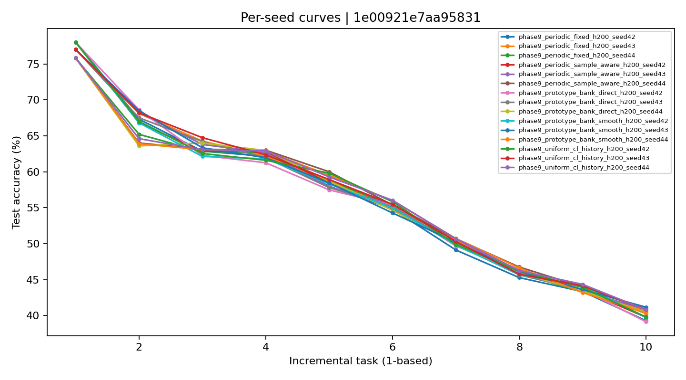
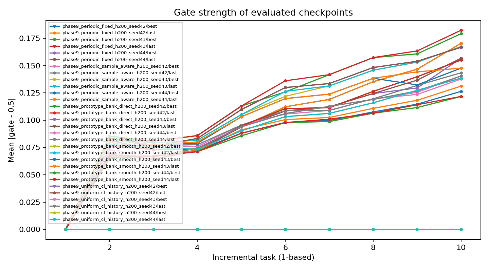
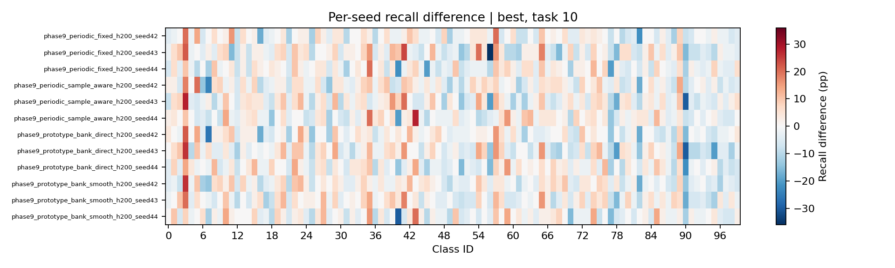
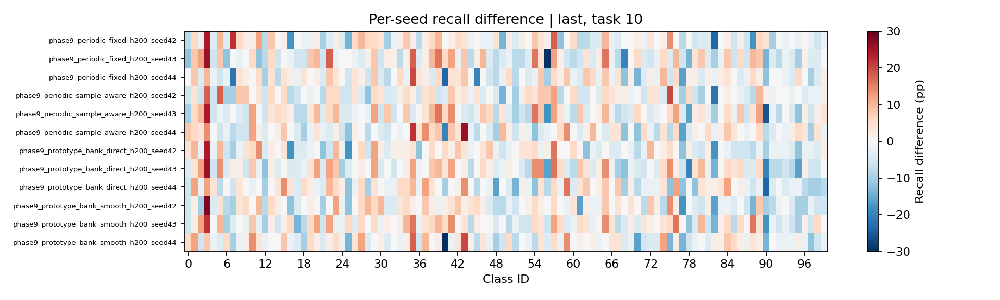
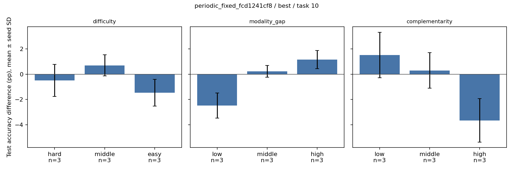
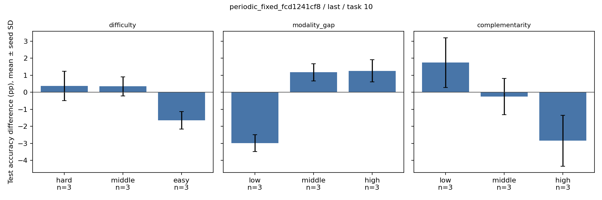
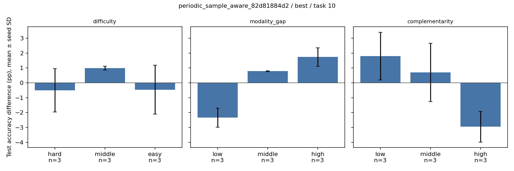
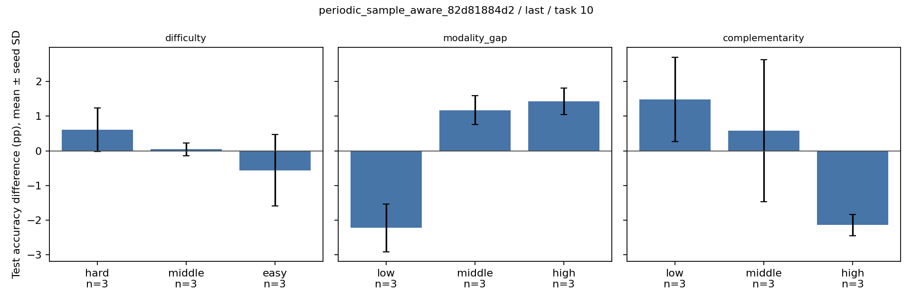
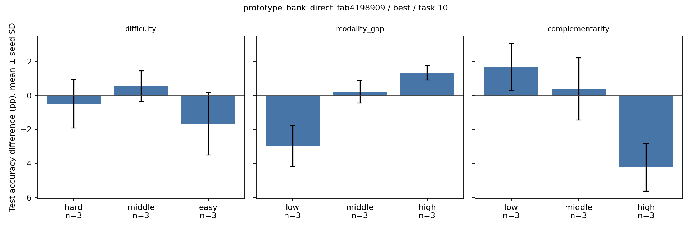
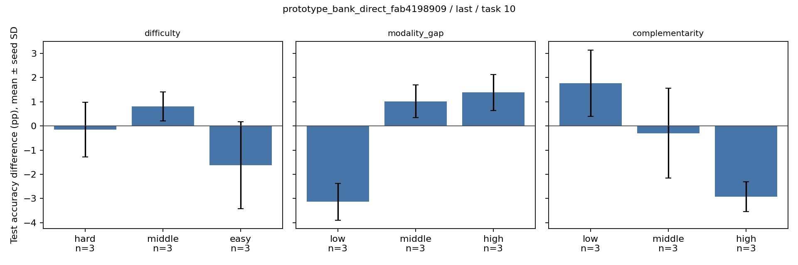
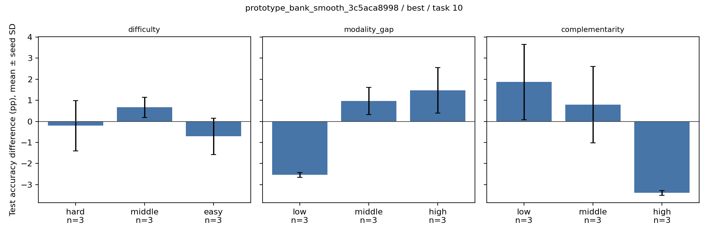
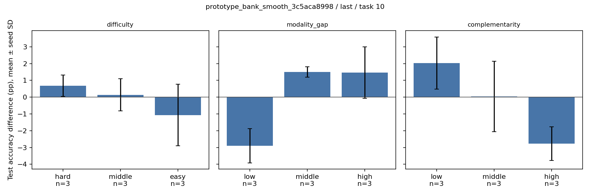
